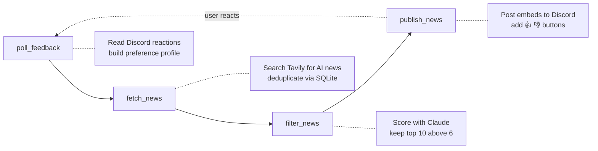

# CurateAI

An automated AI news curation pipeline that fetches, filters, and delivers AI-related news to Discord — and learns from your reactions over time.

## How It Works

CurateAI runs twice daily (6:00 and 18:00 UTC) via Apache Airflow and executes four tasks in sequence:



### The Feedback Loop

1. The bot posts articles to Discord with thumbs up/down reaction buttons
2. You react to articles you like or dislike
3. Next run, the bot polls your reactions and builds a preference profile
4. The preference profile is injected as few-shot examples into Claude's scoring prompt
5. Over time, the bot learns what you care about and filters more accurately

## Setup

### Prerequisites

- Docker and Docker Compose
- API keys: [Tavily](https://tavily.com), [Anthropic](https://console.anthropic.com)
- A Discord bot ([setup guide](https://discord.com/developers/applications))

### 1. Clone and configure

```bash
git clone https://github.com/Saad-Driouech/CurateAI.git
cd CurateAI
cp .env.example .env
```

Edit `.env` with your keys:

```
TAVILY_API_KEY=tvly-...
ANTHROPIC_API_KEY=sk-ant-...
DISCORD_BOT_TOKEN=your_bot_token
DISCORD_CHANNEL_ID=your_channel_id
```

### 2. Start Airflow

```bash
docker compose up airflow-init
docker compose up -d
```

The Airflow UI will be at `http://localhost:8080` (admin/admin).

### 3. Enable the DAG

In the Airflow UI, toggle the `news_curator` DAG on. It will run at 6:00 and 18:00 UTC, or you can trigger it manually.

## Project Structure

```
CurateAI/
├── dags/
│   └── news_curator_dag.py        # Airflow DAG definition
├── src/
│   ├── models.py                  # Pydantic data models
│   ├── fetcher/
│   │   ├── search.py              # Tavily news search client
│   │   └── dedup.py               # SQLite deduplication
│   ├── filter/
│   │   └── scorer.py              # Claude-based article scoring
│   ├── discord/
│   │   └── publisher.py           # Discord embed publisher
│   └── feedback/
│       ├── reaction_poller.py     # Discord reaction reader
│       └── preference_builder.py  # Preference profile builder
├── data/                          # SQLite DB + preferences (gitignored)
├── tests/                         # Unit tests
├── docker-compose.yml             # Airflow + Postgres
├── Dockerfile
├── requirements.txt
└── .env.example
```

## Environment Variables

| Variable | Required | Description |
|---|---|---|
| `TAVILY_API_KEY` | Yes | Tavily search API key |
| `ANTHROPIC_API_KEY` | Yes | Anthropic Claude API key |
| `DISCORD_BOT_TOKEN` | Yes | Discord bot token |
| `DISCORD_CHANNEL_ID` | Yes | Target Discord channel ID |
| `SQLITE_DB_PATH` | No | Path to SQLite DB (default: `data/curator.db`) |
| `AIRFLOW_ADMIN_PASSWORD` | No | Airflow UI password (default: `admin`) |
| `ALERT_EMAIL` | No | Email for Airflow failure alerts |

## Running Tests

```bash
PYTHONPATH=. pytest tests/ -v
```

## Tech Stack

- **Orchestration**: Apache Airflow 2.x (LocalExecutor)
- **News Search**: Tavily API
- **LLM Filtering**: Anthropic Claude (via Instructor for structured output)
- **Messaging**: discord.py
- **Storage**: SQLite
- **Data Models**: Pydantic
- **Retry Logic**: Tenacity
